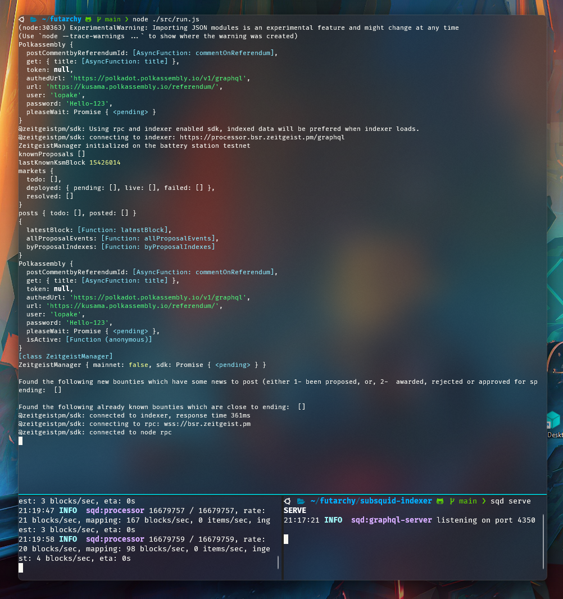

<a name="readme-top"></a>

<br />
<div align="center">
  <a href="https://github.com/polkahack/futarchy">
    
  </a>

<h3 align="center">Futurachy - Main</h3>
  <p align="center">
    We're incentivising altruistic governance!
    <br />
    <a href="https://github.com/PolkaHack/Things" name="demo">Quickstart</a>
    ·
    <a href="https://github.com/PolkaHack/futarchy/issues">Report Bug</a>
    ·
    <a href="https://github.com/polkahack/futarchy/issues">Request Feature</a>
  </p>
</div>

<details>
  <summary>Table of Contents</summary>
  <ol>
    <li>
      <a href="#about-the-project">About The Project</a>
      <ul>
        <li><a href="#Screenshot">Screenshot</a></li>
        <li><a href="#Description">Description</a></li>
        <li><a href="#built-with">Built With</a></li>
      </ul>
    </li>
    <li>
      <a href="#getting-started">Getting Started</a>
      <ul>
        <li><a href="#quick-start">Quickstart</a></li>
        <li><a href="#usage">Usage</a></li>
      </ul>
    </li>
    <li><a href="#contact">Contact</a></li>
    <li><a href="#acknowledgments">Acknowledgments</a></li>
  </ol>
</details>

## About The Project

### Screenshot



### Description

Futarchy - we're incentivising altruistic governance!

#### Summary

1. It spins up a Indexer, which graps Data from the from Kusama Chain.
2. It creates a graphQL endpoint.
3. It fetches extra data from polkassembly based on the graphQL data.
4. It creates and updates markets based on 2 cases.
   - Case 1: been proposed, alias exists
   - Case 2: awarded, rejected or approved, alias updated
5. It creates a Link to the new market.
6. It posts a comment in [polkassembly](https://polkadot.polkassembly.io/) with a link to the created Market.
7. It keeps running.

<p align="right">(<a href="#readme-top">back to top</a>)</p>

### Built With

[![NodeJs][nodejs]][nodejs-url]
[![Subsquid][subsquid]][subsquid-url]
[![Zeitgeist][zeitgeist]][zeitgeist-url]

<p align="right">(<a href="#readme-top">back to top</a>)</p>

## Getting Started

### Quickstart

Quickstart is a simplistic version of Project Futurachy.

Go to to our Quickstart Repo. RIGHT NOW : )

[Quickstart](https://github.com/PolkaHack/Things)


### Usage

./subsquid-indexer
Terminal A
```sh
 cd ./subsquid-indexer
 npm install
 source .env
 npx sqd up
 npx sqd process 
```

Terminal B
```sh
cd ./subsquid-indexer
npx sqd server
```

Terminal C
```sh
npm install
echo "seed=YOUR_SEED_WITH_ZTG_TOKENS_ON_BATERRY_TEST_NEXT" >> .env
source .env
node ./src/run.js
```

## Contact

Sergey Gerodes - [LinkedIn](https://www.linkedin.com/in/sgerodes/)  
K Gunjan - gunjan.cn@gmail.com - [LinkedIn](https://in.linkedin.com/in/gunjan321)  
Frank Bevr - frank_dierolf@web.de - Discord: `FrankBevr#9593`  
Morkeltry - @morkeltry - He will find you

<p align="right">(<a href="#readme-top">back to top</a>)</p>

## Acknowledgments

- [Massimo Luraschi](https://github.com/RaekwonIII)
- [Yornaath](https://github.com/yornaath)
- [Robert Hanson](https://mason.gmu.edu/~rhanson/futarchy.html)
- [Xylodrone]()
- [Bobit]()

<p align="right">(<a href="#readme-top">back to top</a>)</p>

<!-- MARKDOWN LINKS & IMAGES -->

[product-screenshot]: images/screenshot.png
[nodejs]: https://img.shields.io/badge/Node.js-43853D?style=for-the-badge&logo=node.js&logoColor=white
[nodejs-url]: https://nodejs.org
[zeitgeist]: https://img.shields.io/badge/Zeitgeist-Parachain-black?style=for-the-badge&logo=polkadot
[zeitgeist-url]: https://zeitgeist.pm/
[subsquid]: https://img.shields.io/badge/Subsquid-ChainIndexer-black?style=for-the-badge&logo=OctopusDeploy
[subsquid-url]: https://www.subsquid.io/
